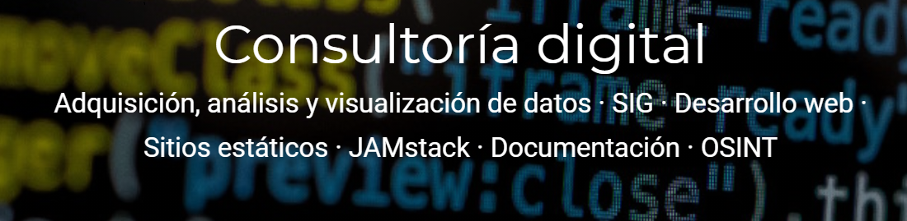

## Bienvenidos 👋

<!--  -->

## Clases 2023/24

- [**DW1A**](https://github.com/DW1A) - Entornos de Desarrollo, Lenguaje de Marcas, Sistemas de Gestión de la Información
- [**DW2A**](https://github.com/DW2A) - Despliegue de aplicaciones
- [**SR1A**](https://github.com/SR1Agrupo) - Lenguaje de marcas y sist. de gestión de información. Intro. a la programación - Python
- [**SR2A**](https://github.com/SR2A) - Seguridad y Alta disponibilidad
- [**DA1D1A**](https://github.com/DA1D1A23) - Entornos de desarrollo

